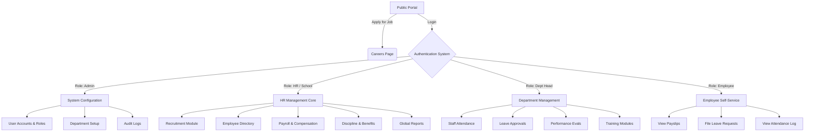
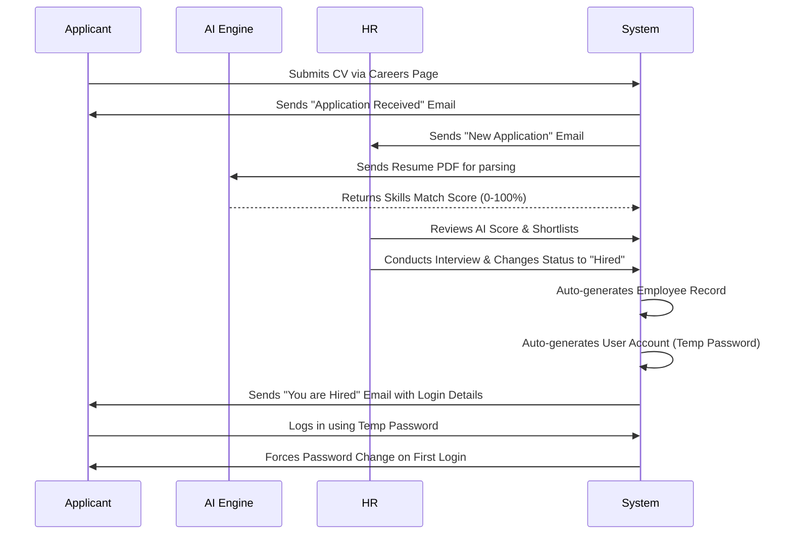
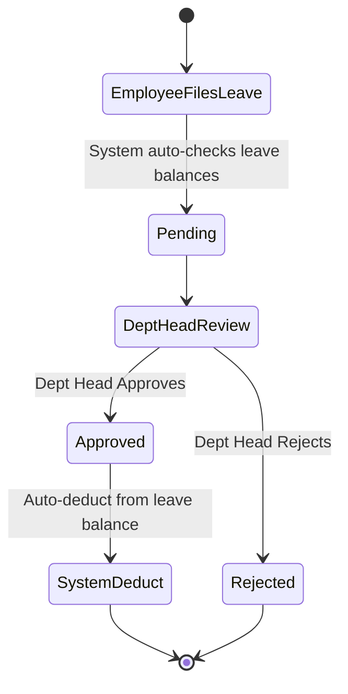

# Bestlink College HRMS — System Workflow

This document outlines the end-to-end workflow of the Bestlink College HRMS, designed for your Pre-Oral Defense presentation.

## Core Roles & Permissions

The system is built on a Role-Based Access Control (RBAC) architecture with 4 primary roles:

1. **Administrator (`admin`)**: Full system access, can manage user accounts, departments, and system settings.
2. **HR Officer (`hr`)**: Manages employees, recruitment, payroll, benefits, and discipline.
3. **Department Head (`dept_head`)**: Can view their department's employees, attendance, leave, performance, and training.
4. **School Administrator (`school`)**: Executive-level read access to all core modules (Reports, Payroll, Employees) for oversight and auditing.
5. **Employee (`employee`)**: Self-service portal to view own attendance, leaves, benefits, and profile.

---

## 1. System-Wide Architecture



---

## 2. Recruitment to Onboarding Workflow

This is the automated process of hiring a new employee.



---

## 3. Payroll Generation Workflow

How the HRMS calculates and generates payroll for employees.

```mermaid
graph LR
    A[Start Payroll Period] --> B[Fetch Employee Base Salary]
    B --> C[Calculate Total Hours Worked]
    C --> D[Deduct Late/Undertime Mins]
    D --> E[Calculate Overtime Pay]
    E --> F[Apply Statutory Deductions]
    F -->|SSS, PhilHealth, Pag-IBIG| G[Calculate Tax (WTX)]
    G --> H[Compute Net Pay]
    H --> I[Generate Payslips]
    I --> J((Finalize Payroll))
```

---

## 4. Leave & Attendance Workflow



---

## 5. Discipline & Performance Workflow

```mermaid
graph TD
    A[Incident Reported] --> B[HR Logs Incident in Discipline Module]
    B --> C{Investigation Status}
    C -->|Pending| D[Gather Evidence]
    C -->|Resolved| E[Issue Disciplinary Action]
    
    E -->|Warning / Suspension| F[Record in Employee Profile]
    F --> G[Affects Performance Evaluation]
    
    H[End of Quarter] --> I[Dept Head Fills Evaluation Form]
    I --> J[Score Calculated]
    J -->|Below 60%| K[Trigger PIP / Training]
    J -->|Above 90%| L[Eligible for Promotion/Bonus]
